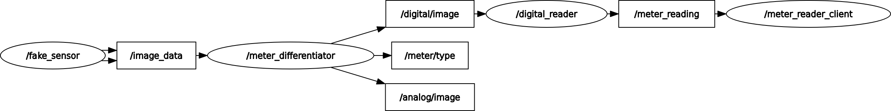

## About
this is a ros application that reads digital meter (like an lcd on a thermostat) using OpenCV heuristics, It first detects if an image contains a Digital or an Analog, Currently for filtering for now, but in the future may be used to route analog meter images for reading as well
---

## Nodes

### fake_sensor
Publishes images from a folder as `sensor_msgs/Image`, or the parameter given.  
Used for testing without physical hardware.

### meter_differentiator
Classifies incoming images (e.g., digital vs analog) and routes them to the appropriate reader topic.
### analog_reader (TODO)

### digital_reader
A classical OpenCV-based reader designed for seven-segment displays.  
This node is fast and offline, but sensitive to lighting and geometry.

### reader_logger
A simple Node that reads the output from 

---
## Node architechture

## Topics

| Topic | Type | Description |
|------|------|-------------|
| `/image_data` | `sensor_msgs/Image` | Raw input images |
| `/digital/image` | `sensor_msgs/Image` | Images routed to digital readers |
| `/meter_reading` | `std_msgs/String` | Final meter reading |
## Usage:
in your ros workspace:
```
mkdir meter_reader && cd meter_reader
git clone 
colcon build
```
example run: 
```
ros2 launch meter_reader meter_reader.launch.py image_folder:=<your workspace path>/meter_reader/images/
```
#### TODOS:
- [] Make an a analog reader node
- [] Train a CNN for reading digital meters
- [] Make the different readers(CNN or heuristic) into services and to be chosen at launch
- [] Add a new option for using an external api for OCR
